# Nextier Signal Engine - Architecture Documentation

## Overview

The Nextier Signal Engine is a **proactive, automated** microservices system for real-time conflict monitoring. The system autonomously scrapes news sources every 15 minutes, extracts events via LLM, calculates risk scores, and triggers instant alerts for critical situations.

## Core Architecture Themes

### 1. Proactive vs Reactive
- **Automated Execution**: Background scheduler eliminates manual intervention
- **Continuous Monitoring**: 15-minute scraping cycles ensure fresh intelligence
- **Instant Alerting**: High-risk detection triggers immediate notifications
- **System Heartbeat**: Real-time status monitoring for operational awareness

### 2. Event-Driven Architecture
- **Asynchronous Communication**: RabbitMQ decouples service dependencies
- **Message Queues**: Scalable processing pipeline (articles → events → signals)
- **Webhook Notifications**: File-based alerts for high-risk articles (score > 85)
- **State Management**: Shared `/data` volume for cross-service coordination

### 3. Clean Architecture
- **Layered Design**: API → Services → Repositories → Data
- **Dependency Injection**: Testable, modular components
- **Scheduler Integration**: Background tasks within application lifecycle

## System Components

### Core Services

#### 1. Scraper Service (Automated)
**Responsibility**: Autonomous news collection with scheduled execution

**Key Features**:
- **Background Scheduler**: APScheduler with 15-min cron trigger (`*/15 * * * *`)
- **Automated Scraping**: Multi-source collection without manual intervention
- **High-Risk Detection**: Identifies articles with risk_score > 85
- **Webhook Alerts**: Writes critical alerts to `/data/high_risk_alerts.json`
- **Automation Logging**: Tracks execution history in `/data/automation_logs.json`
- **Deduplication**: SHA-256 fingerprinting prevents duplicate processing
- **Circuit Breaker**: Protects against source failures

**Technology Stack**:
- FastAPI + APScheduler for automated execution
- BeautifulSoup for web scraping
- Pika for RabbitMQ integration
- PyMongo for MongoDB access

#### 2. Intelligence API Service
**Responsibility**: AI-powered event extraction using LLM

**Key Features**:
- LLM integration with retry mechanisms
- Batch processing for efficiency
- Event validation and normalization
- Background processing with configurable intervals

**Technology Stack**:
- FastAPI for REST APIs
- HTTPX for HTTP client with connection pooling
- Circuit breaker pattern for LLM calls
- Structured logging for observability

#### 3. Predictor Service
**Responsibility**: Risk scoring and economic data analysis

**Key Features**:
- Risk calculation algorithms with economic indicators
- Caching for expensive operations
- Batch processing of events
- Economic data integration

**Technology Stack**:
- FastAPI for REST APIs
- Pandas for data analysis
- NumPy for numerical computations
- LRU caching for performance

### Infrastructure Services

#### 1. MongoDB
**Purpose**: Document storage for all application data

**Collections**:
- `raw_articles`: Scraped news articles
- `parsed_events`: LLM-extracted events
- `risk_signals`: Calculated risk scores
- `economic_data`: Economic indicators by location

#### 2. RabbitMQ
**Purpose**: Message broker for asynchronous communication

**Queues**:
- `scraped_articles`: Articles from scraper to intelligence API
- `parsed_events`: Events from intelligence API to predictor
- `risk_signals`: Risk signals for downstream consumers

## Data Flow Architecture (Automated)

```mermaid
flowchart LR
    A[⏰ Scheduler] -->|15min| B[🔍 Scraper]
    N[📰 News] --> B
    B -->|articles| Q1[Queue]
    B -->|high risk| W[🚨 Alerts]
    
    Q1 --> C[🧠 Intelligence API]
    C -->|events| Q2[Queue]
    
    Q2 --> D[📊 Predictor]
    E["🌡️ Climate
    ⛏️ Mining
    🗺️ Border
    💰 Economic"] --> D
    D -->|signals| Q3[Queue]
    
    W --> UI[🖥️ Dashboard]
    Q3 --> UI
    
    B --> DB[(MongoDB)]
    C --> DB
    D --> DB
```



## Service Communication Patterns

### 1. Synchronous Communication
- **REST APIs**: Administrative and query operations
- **Health Checks**: Service dependency monitoring
- **Scheduler Status**: Real-time execution state (`/api/v1/scheduler/status`)
- **Automation Logs**: Historical execution data (`/api/v1/automation/logs`)

### 2. Asynchronous Communication
- **Message Queues**: Data processing pipeline (RabbitMQ)
- **File-Based Webhooks**: High-risk alerts via shared volume
- **Scheduled Execution**: Background tasks via APScheduler
- **State Polling**: UI polls for updates every 5-10 seconds

## Resilience Patterns

### 1. Circuit Breaker
```python
@circuit(failure_threshold=5, recovery_timeout=30)
async def call_ollama_llm(text: str):
    # LLM call with circuit breaker protection
```

### 2. Retry Mechanism
```python
@retry(stop=stop_after_attempt(3), wait=wait_exponential(multiplier=1, min=2, max=10))
async def fetch_with_retry(url):
    # HTTP request with exponential backoff
```

### 3. Connection Pooling
```python
client = httpx.AsyncClient(
    limits=httpx.Limits(max_connections=100, max_keepalive_connections=20)
)
```

## Security Architecture

### 1. Input Validation
- **Pydantic Models**: Type-safe input validation
- **Field Constraints**: Length, format, and value validation
- **Sanitization**: Prevention of injection attacks

### 2. CORS Configuration
- **Origin Restrictions**: Limited to specific domains
- **Method Controls**: Allowed HTTP methods only
- **Header Validation**: Controlled header access

### 3. Error Handling
- **Sanitized Errors**: No sensitive information leakage
- **Structured Logging**: Security event tracking
- **Graceful Degradation**: Service continues with reduced functionality

## Performance Architecture

### 1. Caching Strategy
- **LRU Cache**: For expensive LLM operations
- **Connection Pooling**: Reuse HTTP connections
- **Batch Processing**: Efficient resource utilization

### 2. Async Processing
- **Non-blocking I/O**: Throughout the application stack
- **Concurrent Processing**: Multiple items processed simultaneously
- **Background Tasks**: Long-running operations

### 3. Resource Management
- **Connection Limits**: Prevent resource exhaustion
- **Timeout Configuration**: Prevent hanging operations
- **Graceful Shutdown**: Proper resource cleanup

## Observability Architecture

### 1. Structured Logging
```json
{
  "timestamp": "2024-01-01T10:00:00Z",
  "level": "info",
  "service": "scraper",
  "message": "Article scraped successfully",
  "article_id": "123",
  "processing_time": 150,
  "correlation_id": "abc-123"
}
```

### 2. Health Checks
- **Dependency Monitoring**: Database and message broker status
- **Resource Metrics**: Memory, CPU, and connection usage
- **Business Metrics**: Processing rates and error rates

### 3. Performance Monitoring
- **Request Tracing**: End-to-end request flow tracking
- **Database Metrics**: Query performance and connection usage
- **Queue Metrics**: Message depth and processing rates

## Deployment Architecture

### 1. Containerization
- **Docker**: Service containerization
- **Docker Compose**: Local development and testing
- **Environment Variables**: Configuration management

### 2. Service Discovery
- **Fixed Ports**: Predictable service endpoints
- **Health Endpoints**: Service availability monitoring
- **Dependency Management**: Service startup ordering

### 3. Scaling Strategy
- **Horizontal Scaling**: Multiple service instances
- **Load Distribution**: Message queue-based load balancing
- **Resource Isolation**: Independent service resources

## Development Architecture

### 1. Code Organization
```
service/
├── api/           # FastAPI routes and endpoints
├── models/        # Pydantic models for validation
├── services/      # Business logic and services
├── repositories/  # Data access layer
├── utils/         # Configuration and utilities
└── tests/         # Unit and integration tests
```

### 2. Testing Strategy
- **Unit Tests**: Component isolation testing
- **Integration Tests**: Service interaction testing
- **Performance Tests**: Load and stress testing
- **Mock Services**: External dependency mocking

### 3. Quality Assurance
- **Type Hints**: Static type checking
- **Code Standards**: PEP 8 compliance
- **Documentation**: Comprehensive API documentation
- **Continuous Integration**: Automated testing and validation

## Evolution Architecture

### 1. Extensibility
- **Plugin Architecture**: Easy addition of new processors
- **Message Schema Evolution**: Backward-compatible changes
- **Service Versioning**: API version management

### 2. Scalability
- **Microservice Decomposition**: Further service splitting
- **Event Sourcing**: Complete event history
- **CQRS Pattern**: Read/write model separation

### 3. Technology Evolution
- **Container Orchestration**: Kubernetes migration
- **Service Mesh**: Advanced service communication
- **Event Streaming**: Kafka or similar technologies

## Decision Log

### 1. MongoDB vs Relational Database
**Decision**: MongoDB for document storage
**Rationale**: 
- Flexible schema for varied article formats
- Natural fit for JSON-based data structures
- Horizontal scaling capabilities

### 2. RabbitMQ vs Kafka
**Decision**: RabbitMQ for message queuing
**Rationale**:
- Simpler operational requirements
- Good fit for current message volumes
- Reliable message delivery guarantees

### 3. FastAPI vs Other Frameworks
**Decision**: FastAPI for REST APIs
**Rationale**:
- Native async support
- Automatic API documentation
- Type safety with Pydantic integration
- High performance

### 4. LLM Integration Strategy
**Decision**: Direct HTTP integration with Ollama
**Rationale**:
- Local deployment for data privacy
- Cost-effective for current usage
- Customizable model selection

This architecture provides a solid foundation for the Nextier Signal Engine, balancing performance, reliability, and maintainability while supporting future growth and evolution.
